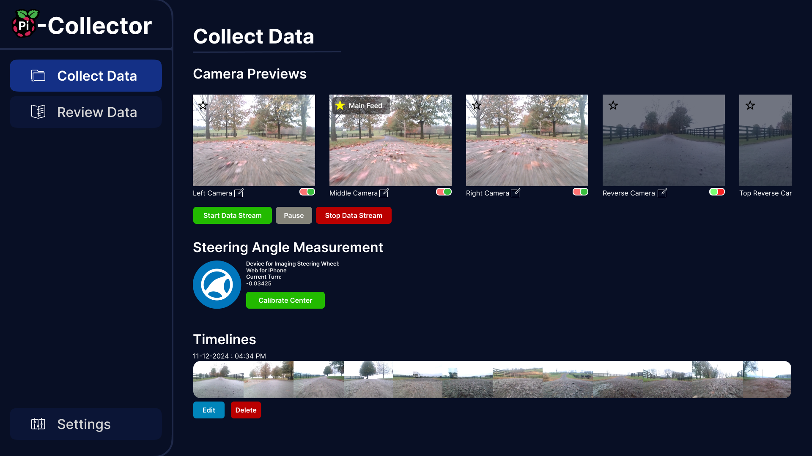
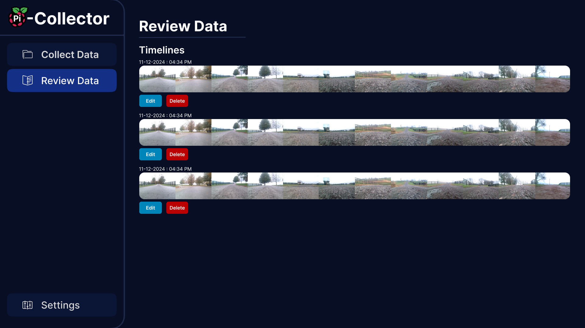
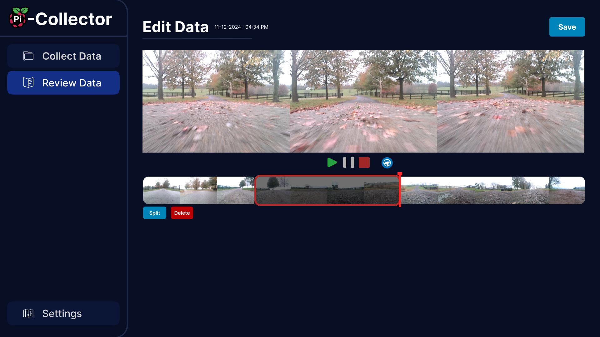
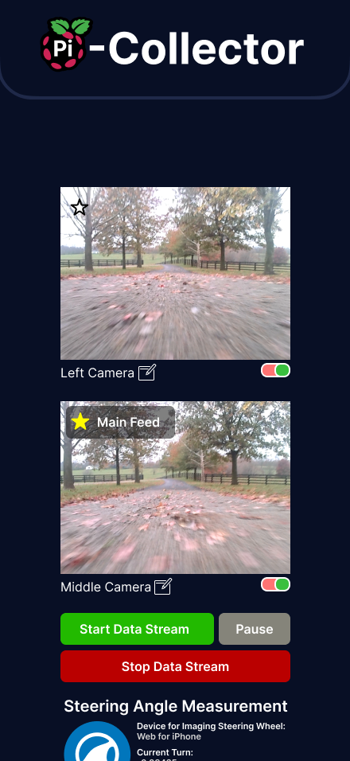
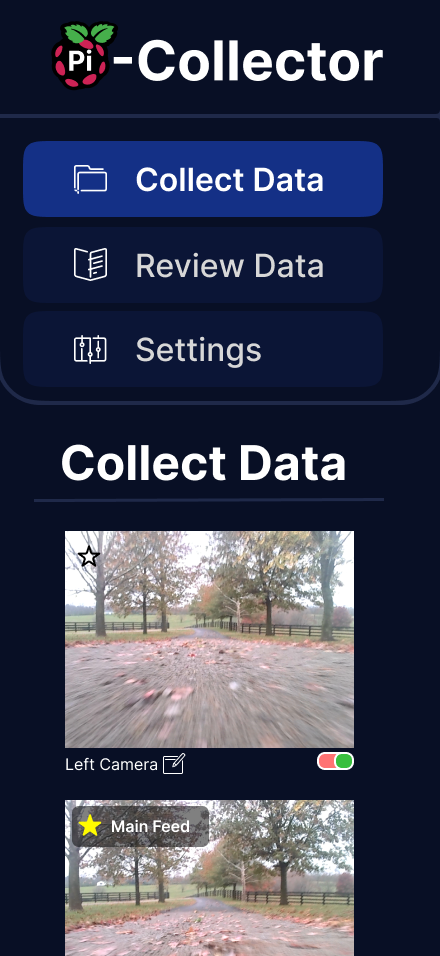

# PiCollector

**Helping developers effortlessly collect and refine training data for self-driving applications.**


## Overview
PiCollector is a modern and intuitive data collection platform designed to streamline the process of gathering synchronized image and steering angle data for machine learning applications, particularly for self-driving RC cars. This project aims to simplify the data collection process, making it accessible even for non-technical users.

The application runs headlessly on a Raspberry Pi, providing a sleek web interface accessible via a phone or laptop on the local network. Users can configure camera setups, connect gyroscopic devices (e.g., smartphones), and collect labeled data efficiently at customizable frame rates. 

## Early Stage Prototype
Below are some prototype designs for the PiCollector platform:

### Desktop Views

#### Collect Data Page


#### Review Data Page


#### Edit Data Page


### Molbie Views

#### Collect Data Page (Minimized NavBar)


#### Collect Data Page (Expanded NavBar)


## Current Status
This project is in its **very early prototype stage** and is still in active development. Core features and functionalities are being planned, including:
- Live data collection with image preview and QR-based steering angle tracking.
- Session management for starting, stopping, and reviewing data collection.
- A built-in editor for refining and labeling collected data.
- An intuitive setup wizard for configuring connected cameras and devices.

The next steps include:
- Finalizing the integration of collected steering and image data into the API.
- Refining the session review and editing tools.
- Adding advanced configuration options for cameras and frame rates.

Stay tuned as the project continues to evolve with more features and enhancements!

## Vision
The ultimate goal of PiCollector is to provide a versatile and user-friendly tool for developers and hobbyists to collect high-quality training data for machine learning models. The project is being built to support individual needs and has the potential to grow into a broader solution for similar use cases.

---

## Installation and Deployment

### Requirements
- A Raspberry Pi (headless configuration supported)
- Python 3.11+
- Node.js 16+
- Git installed on the Raspberry Pi

### Quick Installation Instructions

1. **Clone the Repository:**
   ```bash
   git clone https://github.com/KobyPierce/PiCollector.git
   cd PiCollector
   ```

2. **Run the Setup Script:**
   This will install all dependencies for both the frontend and backend.
   ```bash
   ./setup.sh
   ```

3. **Start the Application:**
   Launch both the backend and frontend services with a single command:
   ```bash
   ./start.sh
   ```

4. **Access the Web App:**
   Open your web browser and navigate to:
   ```
   http://<PI_IP>:3000
   ```
   Replace `<PI_IP>` with the IP address of your Raspberry Pi.

5. **Stop the Application:**
   Use the following command to stop both the backend and frontend services:
   ```bash
   ./stop.sh
   ```

---

## Contributing
While the project is not yet ready for public contributions, feedback and suggestions are welcome to help shape its development. Stay tuned for updates as the prototype evolves!

## License
This project is licensed under the Mozilla Public License 2.0. See the [LICENSE](LICENSE) file for details.
